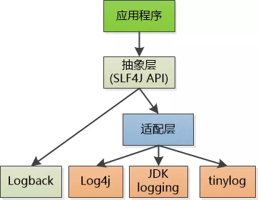

# logback-chinese-manual
logback 中文手册
> 翻译自 [The logback manual](https://logback.qos.ch/manual/index.html)  

[在线地址](https://logbackcn.gitbook.io/logback/)  

## 简介

Logback 继承自 log4j。

Logback 的架构非常的通用，适用不同的使用场景。Logback 被分成三个不同的模块：logback-core，logback-classic，logback-access。

logback-core 是其它两个模块的基础。logback-classic 模块可以看作是 log4j 的一个优化版本，它天然的支持 SLF4J，所以你可以随意的从其它日志框架（例如：log4j 或者 java.util.logging）切回到 logack。

logback-access 可以与 Servlet 容器进行整合，例如：Tomcat、Jetty。它提供了 http 访问日志的功能。

## The logback manual

手册包括了最新版本的 logback，总共有 150 多页，以及许多具体的例子，主要包含以下基本的和高级的特性：

- logback 的整体架构
- 讨论 logback 最好的实践以及反模式
- logback 的 xml 配置方式
- appender
- encoder
- layout
- filter
- 上下文诊断
- Joran - logback 的配置系统

logback 手册尽可能详细的描述了 logback API，包括它的特性以及设计原理。logback 手册适用于那些使用 java 但是是 logback 新手的人，也适合那些对 logback 有一定经验的人。在手册的帮助下，新手可以快速上手。

* [第一章：logback 介绍](https://github.com/Volong/logback-chinese-manual/blob/master/01%E7%AC%AC%E4%B8%80%E7%AB%A0%EF%BC%9Alogback%20%E4%BB%8B%E7%BB%8D.md)  
* [第二章：架构](https://github.com/Volong/logback-chinese-manual/blob/master/02%E7%AC%AC%E4%BA%8C%E7%AB%A0%EF%BC%9A%E6%9E%B6%E6%9E%84.md)  
* [第三章：logback 的配置](https://github.com/Volong/logback-chinese-manual/blob/master/03%E7%AC%AC%E4%B8%89%E7%AB%A0%EF%BC%9Alogback%20%E7%9A%84%E9%85%8D%E7%BD%AE.md)  
* [第四章：Appenders](https://github.com/Volong/logback-chinese-manual/blob/master/04%E7%AC%AC%E5%9B%9B%E7%AB%A0%EF%BC%9AAppenders.md)  
* [第五章：Encoder](https://github.com/Volong/logback-chinese-manual/blob/master/05%E7%AC%AC%E4%BA%94%E7%AB%A0%EF%BC%9AEncoder.md)   
* [第六章：Layouts](https://github.com/Volong/logback-chinese-manual/blob/master/06%E7%AC%AC%E5%85%AD%E7%AB%A0%EF%BC%9ALayouts.md)  
* [第七章：Filters](https://github.com/Volong/logback-chinese-manual/blob/master/07%E7%AC%AC%E4%B8%83%E7%AB%A0%EF%BC%9AFilters.md)  
* [第八章：MDC](https://github.com/Volong/logback-chinese-manual/blob/master/08%E7%AC%AC%E5%85%AB%E7%AB%A0%EF%BC%9AMDC.md)  
* [第九章：日志隔离](https://github.com/Volong/logback-chinese-manual/blob/master/09%E7%AC%AC%E4%B9%9D%E7%AB%A0%EF%BC%9A%E6%97%A5%E5%BF%97%E9%9A%94%E7%A6%BB.md)  
* [第十章：JMX 配置器](https://github.com/Volong/logback-chinese-manual/blob/master/10%E7%AC%AC%E5%8D%81%E7%AB%A0%EF%BC%9AJMX%20%E9%85%8D%E7%BD%AE%E5%99%A8.md)  
* [第十一章：Joran](https://github.com/Volong/logback-chinese-manual/blob/master/11%E7%AC%AC%E5%8D%81%E4%B8%80%E7%AB%A0%EF%BC%9AJoran.md)  
* [第十二章：Groovy 配置](https://github.com/Volong/logback-chinese-manual/blob/master/12%E7%AC%AC%E5%8D%81%E4%BA%8C%E7%AB%A0%EF%BC%9AGroovy%20%E9%85%8D%E7%BD%AE.md)  
* [第十三章：从 log4j 迁移](https://github.com/Volong/logback-chinese-manual/blob/master/13%E7%AC%AC%E5%8D%81%E4%B8%89%E7%AB%A0%EF%BC%9A%E4%BB%8E%20log4j%20%E8%BF%81%E7%A7%BB.md)  
* [第十四章：Receivers](https://github.com/Volong/logback-chinese-manual/blob/master/14%E7%AC%AC%E5%8D%81%E5%9B%9B%E7%AB%A0%EF%BC%9AReceivers.md)  
* [第十五章：使用 SSL](https://github.com/Volong/logback-chinese-manual/blob/master/15%E7%AC%AC%E5%8D%81%E4%BA%94%E7%AB%A0%EF%BC%9A%E4%BD%BF%E7%94%A8%20SSL.md)

> 图片来源：<a href="#note1">1</a>

推荐阅读：
1. [一个著名的日志系统是怎么设计出来的？](https://mp.weixin.qq.com/s/XiCky-Z8-n4vqItJVHjDIg)
2. [架构师必备，带你弄清混乱的JAVA日志体系！](https://mp.weixin.qq.com/s/8VvBdRH_Yc-Dt4HFGbC5rg)
